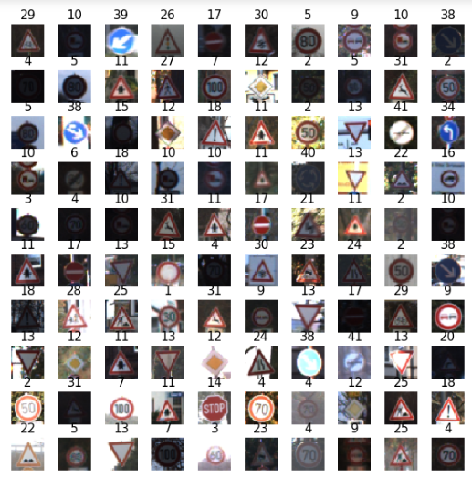
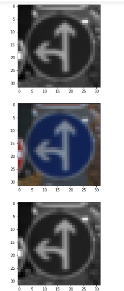

# traffic_sign_classification
traffic sign classification is an important task for self driving cars.
this project is CNN based , using keras and tensflow as the lower layer with 90 percent accuracy.
## prerequisite
familarity with python and artifical neural network and basic undertandings.

## dataset
 The dataset is consist of 43 different classes 
 the image are 32X32 pixels
 RGB images

## intallation
1) Clone this reposiroty or simply download it and put these files into you anaconda directory if using anaconda other wise to the place of your IDE use its saved files.
2) Following directoires which are very important to run this program:
 
 1)matplotlib.pyplot (pip install matplotlib)
  
 2)numpy  (pip/pip3 install numpy)
  
 3)tensorflow (pip install --upgrade tensorflow)
  
 4)pandas (pip install pandas)
  
 5)seaborn (pip install seaborn)
  
 6)pickle (pip install pickle)
  
 7)random (pip install random)
  
ones these all are done run the code.

## Example of images of dataset into 10X10 matric of images



## Example after normalize 
```python
  # converting to grey scale
  X_train_gray= np.sum(X_train/3,axis=3 ,keepdims= True)
  X_test_gray= np.sum(X_test/3,axis=3 ,keepdims= True)
  X_validation_gray= np.sum(X_validation/3,axis=3 ,keepdims= True)

 #normalizing the images 
 X_train_gray_norm=(X_train_gray -128)/128
 X_test_gray_norm=(X_test_gray -128)/128
 X_validation_gray_norm=(X_validation_gray -128)/128
```



